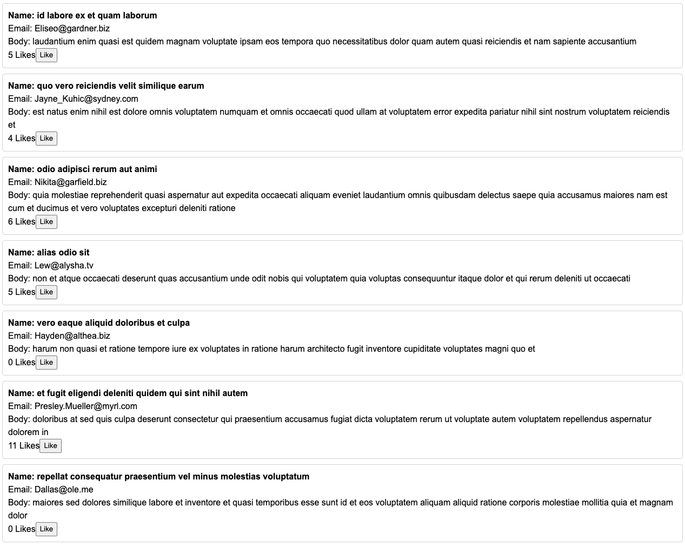

# FrontendCodingChallenge

### Setup
1. Clone the project to your local machine
2. Install dependencies
3. Start it with `npm start` - it should display `dasboard works!`

### Task:
Create a simple application to show comments (fake API: `https://jsonplaceholder.typicode.com/comments`) with the possibility to like them (client-side).

### Infos:
- Use NGRX as state-management, everything is set up at `libs/feature-dashboared/src/lib/+state`
- HttpClient is already set up
